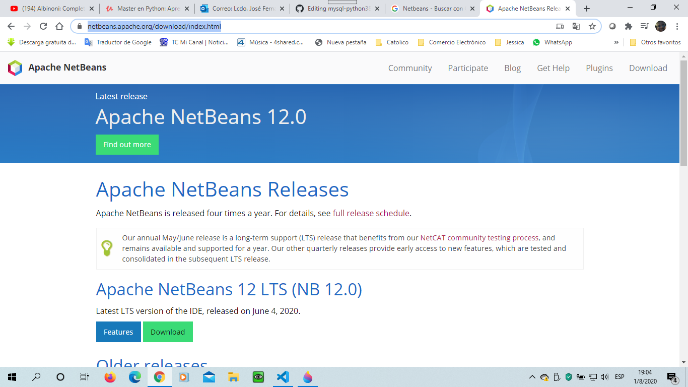

# mysql-python38
Descripcion de Maneja de Base de Datos de Mysql Server en Python

Vamos a preparar nuestro entorno de desarrollo para programar en PHP, basicamente tenemos que tener 3 cosas para poder trabajar en entorno de desarrollo en PHP necesitamos lo primero que todo tener un navegador WEB (que puede ser Google Chrome, Opera, Firefox, o Internet Explorer); en mi caso voy a estar usando Google Chrome que es el navegador mas completo y el más estable que hay, pero puedes utilizar firfox, opera, pero personalmente te recomiento el que es Google Chrome ya que es el más completo y el más estable que hay, otra cosa que necesita es un editor de código o un entorno de desarrollo integrado (I.D.E); la diferencia que hay en un editor de código y el entorno de desarrollo integrado es que el editor de código solo sirve para escribir código, editar código y el entorno de desarrollo integrado (I.D.E) es más completo no solamente tiene un editor de código, tiene otras herramientas integradas reconocimiento avanzado de clases, manejador de bases de datos, a parte tiene manejador de base de datos con Mysql Server, María DB (que es prácticamente lo mismo).

Vamos a usar el entorno de desarrollo integrado que es Netbeans que es el más completo, pero que también se puede usar sublime text 3, visual studios code, yo voy a utilizar Netbeans pero tu puedes usar el editor de codigo que más prefieras a tu elección, Netbeans ocupa mucho más recursos de la máquina que Sublime text, lo bueno que tiene el editor de código netbeans que puedes conectarte a la base de datos Mysql server o a la base de datos que tu deseas.
Para instalar netbeans desde la pagina WEB de Google https://www.google.com/ ponemos Netbeans seleccionamos el link o enlace de la página oficial de NetBeans

  

https://netbeans.org/ y seleccionamos descargas, a lo que seleccionar descargar se despliga otra ventama donde seleccionas la opción más reciente de Netbeans que vas a instalar (https://netbeans.apache.org/download/index.html) 

  

en download lo descargar y una vez descargado procedes a realizar la instalación poniendo siguiente, siguiente seguir los pásos del asistente de la instalación hasta realizar la instalación.

Si desea descargar Sublime Text 3 para instalarlo ya que es un editor de codigo mucho más ligero que Netbeans simplemente desde el navegador del google en la página WEB de https://www.google.com/ ponemos Sublime Text y nos aparecer varios enlaces de Sublime Text en donde ingresamos al link o enlace de la página Oficial de Sublime Text que es https://www.sublimetext.com/ (adjunto pantalla de la página Oficial)

y de la página Oficial de Sublime Text para descargarlo das un click en download y comienzas a descargarlo, una vez descargado lo procedes a instalar siguiente los pasos del asistente para la instalación.

Y hay algo bien importante que tengas en cuenta y obligatorio a instalar que es un servidor de aplicaciones WEB, un servidor de aplicaciones WEB que es un conjunto de herramientas que están disponibles para el usuario.Un servidor de entorno WEB tiene PHP, Apache para poder programar en PHP, tiene Mysql para poder trabajar con nuestras bases de datos, que se puede hacer para tener un servidor de aplicaciones web, se tiene varias alternativas desde la página web https://www.google.com/ podemos descargar wamp server o xampp, pero el que te recomiendo y el que voy a utilizar es wampserver, para entrar a la página WEB oficial de Wamp server desde la página WEB https://www.google.com/ digitamos wamp server y entramos a la página oficial de wamps server

https://www.wampserver.com/en/ (Página Oficial de Wamps server)

nos vamos a la opción descargas que tenemos la siguiente página.

Al instalar wamps server se tiene varios avisos y lo más importante que debes de tener instalado el paquete de instalación de Visual C++ de Microsoft http://www.microsoft.com/en-us/download/details.aspx?id=30679 

Wamps serrver lo podemos descargar desde la página https://sourceforge.net/projects/wampserver/files/WampServer%203/WampServer%203.0.0/wampserver3.2.0_x64.exe/download

donde una vez que se instale el instalador de wamps server lo procedes a instalar siguiendo los pasos del asistente paso a paso en la instalación.

El mismo tipo de consultas que puedes hacer con Python al usar SqLite que es un gestor de bases de datos más ligero puedes hacer con Mysql server que es mas potente con SqLite y para poder trabajar con Mysql Server para poder trabajar en Python hay que tener un modulo que se llama Mysql connector Python, se puede tener instalado mysql desde dos formas:
1) Si bien puedes instalar mysql desde la página oficial de Mysql https://www.mysql.com/ (Pagina Oficial)

https://www.mysql.com/downloads/

Entramos a Mysql de la comunidad y lo descargas.

También lo puedes descargar desde la página WEB https://pypi.org/project/mysql-connector-python/ 
que lo descargas desde allí

En el presente ejercicio de Python con Mysql se va a realizar las operaciones de creación de bases de datos, tablas, ingresar registros, consultas, eliminación y actualización por medio de procedimientos definidos en el programa de python, adjunto codigo, con la base de datos de prueba agenda

# Establecer la conexion a la base de datos
import mysql.connector
from mysql.connector import Error

conn = mysql.connector.connect(
     host="localhost",
     user="root",
     passwd="",
     database="agenda"
)

# Para la creacion de la base de datos si no existe
def crear_base():
     
    cursor = None

    try:

        # crear la base de datos
        cursor = conn.cursor()
   
        cursor.execute("CREATE DATABASE IF NOT EXISTS agenda")

        # para comprobar que la base de datos existe
        cursor.execute("SHOW DATABASES")

        print("\n")
        print("###### Informacion de las bases de datos ######## \n",end="")
        print("\n")

        for bd in cursor:
            print(bd)
    except Error as e:
        print(e)
    finally:
        if conn:
            print("Se creo la base de datos exitosamente o ya existe......\n",end="")             

def crear_tabla():

    cursor = None

    try:

        cursor = conn.cursor()

        # Crear la tabla
        cursor.execute("CREATE TABLE IF NOT EXISTS libreta(" +
            "id int(10) auto_increment not null, " +
            "apellidos varchar(30) not null, " +
            "nombres varchar(30) not null, " +
            "direccion varchar(100) not null, " +
            "telefono varchar(10) not null, " +
            "email varchar(50) null, "
            "CONSTRAINT pk_libreta PRIMARY KEY(id)"
            ")")
        # verificar si la tabla se creo
        cursor.execute("SHOW TABLES")

        print("\n")
        print("##### Se verifica tabla creada ######\n",end="")
        print("\n")

        for tabla in cursor:
            print(tabla)
    except Error as e:
        print(e)
    finally:
        if conn:
            print("Se creo la tabla exitosamente....!\n",end="")

def ingresar_datos(persona):

    cursor = None

    try:

        cursor = conn.cursor()

        # Ingresar datos a la tabla libreta
        cursor.executemany("INSERT INTO libreta(id,apellidos,nombres,direccion,telefono,email) " +
        "VALUES(null,%s,%s,%s,%s,%s)",persona)

        conn.commit()
        
    except Error as e:
        print(e)
    finally:
        if conn:
            print("Se ingreso registros exitosamente....!\n",end="")

def consulta_registros():
    
    cursor = None

    try:

        cursor = conn.cursor()
        cursor.execute("SELECT * FROM libreta")

        registros = cursor.fetchall()

        for datos in registros:
            print("Id           :",datos[0])
            print("Apellidos    :",datos[1])
            print("Nombres      :",datos[2])
            print("Direccion    :",datos[3])
            print("Telefono     :",datos[4])
            print("Email        :",datos[5])
            print("\n")
    except Error as e:
        print(e)
    finally:
        if conn:
            print("Consulta exitosamente...!\n",end="")

def borrar_registros():
    cursorcon = None
    cursoract = None
    codigo = None
  
    apellidos1 = input("Ingrese Apellidos a Eliminar : ")
    nombres1 = input("Ingrese nombres a Eliminar : ")
    
 
    try:

        cursorcon = conn.cursor()
        cursoract = conn.cursor()
        # Busca registro
        cadena1 = "SELECT * FROM libreta WHERE apellidos LIKE %s AND nombres LIKE %s"
        datos1 = (apellidos1,nombres1)

        cursorcon.execute(cadena1, datos1)
        # Mostrar registro
        registros = cursorcon.fetchall()

        for fila in registros:
            print("Id               :",fila[0])
            print("Apellidos        :",fila[1])
            print("Nombres          :",fila[2])
            print("Direccion        :",fila[3])
            print("Telefono         :",fila[4])
            print("Email            :",fila[5])
            print("\n")

        opcion1 = input("¿Esta Seguro eliminar Registro S/N : ")
        if opcion1 == 'S' or opcion1 == 's':

            print("\n")
            print("####### Se va a eliminar datos para actualizar ######\n",end="")
            print("\n")

            
            cadena = "DELETE FROM libreta WHERE apellidos = %s AND nombres = %s" 

            datos = (apellidos1, nombres1)
        
            cursoract.execute(cadena, datos)
        
            # Guardar los cambios
            conn.commit()
        else:
            print("No se procede a eliminar.....!\n",end="")    
    except Error as e:
        print(e)
    finally:
        if conn:
            print("Fin de procedimiento.....!\n",end="")
   
    
def actualizar_registro():

    cursorcon = None
    cursoract = None
    codigo = None
  
    apellido1 = input("Ingrese Apellidos a buscar : ")
    nombres1 = input("Ingrese nombres a buscar : ")
    apellido2 = input("Ingrese Apellido a Corregir : ")
    nombre2 = input("Ingrese nombre a Corregir :")
    
 
    try:

        cursorcon = conn.cursor()
        cursoract = conn.cursor()
        # Busca registro
        cadena1 = "SELECT * FROM libreta WHERE apellidos LIKE %s AND nombres LIKE %s"
        datos1 = (apellido1,nombres1)

        cursorcon.execute(cadena1, datos1)
        # Mostrar registro
        registros = cursorcon.fetchall()

        for fila in registros:
            print("Id               :",fila[0])
            print("Apellidos        :",fila[1])
            print("Nombres          :",fila[2])
            print("Direccion        :",fila[3])
            print("Telefono         :",fila[4])
            print("Email            :",fila[5])
            print("\n")

        print("\n")
        print("####### Se va a ingresar datos para actualizar ######\n",end="")
        print("\n")

        codigo = int(input("Ingrese Codigo : "))

        cadena = "UPDATE libreta SET apellidos = %s, nombres = %s WHERE id = %s" 

        datos = (apellido2, nombre2, codigo)
     
        cursoract.execute(cadena, datos)
      
        # Guardar los cambios
        conn.commit()
    except Error as e:
        print(e)
    finally:
        if conn:
            print("Se actualizo registro.....!\n",end="")
   
seguir = True

while seguir:
    crear_base()
    crear_tabla()
    #### menu principal
    print("\n")
    print("##### ###### menu principal ########\n",end="")
    print("\n")
    print("1.- Ingrese de datos automatizados por la computadora\n",end="")
    print("2.- Consulta de datos\n",end="")
    print("3.- Eliminacion de datos\n",end="")
    print("4.- Actualizacion de datos\n",end="")
    print("5.- Salir\n",end="")
    opcion = int(input("Digite su opcion 1-5 : "))

    verificar1 = isinstance(opcion,int)

    while not verificar1 or (opcion <= 0 or opcion > 5):
        opcion = int(input("Digite su opcion 1-5 : "))

    if opcion == 1:
        ape = input("Ingrese apellidos : ")
        nom = input("Ingrese nombres   : ")
        direccion = input("Ingrese Direccion : ")
        tele = input("Ingrese telefono : ")
        correo = input("Ingrese correo electronico : ")
        Persona = [(ape,nom,direccion,tele,correo)]
        ingresar_datos(Persona)
    if opcion == 2:
        consulta_registros()
    if opcion == 3:
        borrar_registros()
    if opcion == 4:
        actualizar_registro()
    if opcion == 5:
        seguir = False

